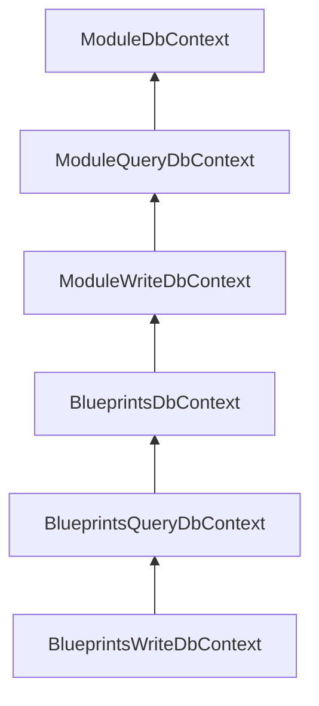

# EngineBay.Persistence

[](https://badge.fury.io/nu/EngineBay.Persistence)
[](https://codeclimate.com/github/engine-bay/persistence/maintainability)
[](https://codeclimate.com/github/engine-bay/persistence/test_coverage)


Persistence module for EngineBay published to [EngineBay.Persistence](https://www.nuget.org/packages/EngineBay.Persistence/) on NuGet.

## About

The persistence module provides structures to configure and register any database connections that modules in your application might need.

The DbContexts from this module should be inherited by the DbContexts of any module that needs to use a database. To support [Command and Query Responsibility Segregation (CQRS)](https://learn.microsoft.com/en-us/azure/architecture/patterns/cqrs), a [read-optimised](EngineBay.Persistence/DbContexts/ModuleQueryDbContext.cs) and a [write-optimised](EngineBay.Persistence/DbContexts/ModuleWriteDbContext.cs) DbContext are provided - though a [general-purpose](EngineBay.Persistence/DbContexts/ModuleDbContext.cs) one is also provided. 

The [TimestampInterceptor](EngineBay.Persistence/Interceptors/TimestampInterceptor.cs) will add creation and modification timestamps to any model that implements [EngineBay.Core's](https://github.com/engine-bay/core) [BaseModel](https://github.com/engine-bay/core/blob/main/EngineBay.Core/Models/BaseModel.cs).

The [AuditableModel](EngineBay.Persistence/Models/AuditableModel.cs) abstract class will provide some standard fields for tracking which users make changes to any inheriting models. If changes are saved on a DbContext that uses [EngineBay.Auditing's]([EngineBay.Auditing](https://github.com/engine-bay/auditing)) [AuditInterceptor](https://github.com/engine-bay/auditing/blob/main/EngineBay.Auditing/Interceptors/AuditingInterceptor.cs), then audit entries will automatically be created for any models that implement AuditableModel.

[ApplicationUser](https://github.com/engine-bay/persistence/blob/efefc4fef4a0b7478abf288237ba1d563d88cb5e/EngineBay.Persistence/Models/ApplicationUser.cs) is a simple representation of a user for the application. It has a DbSet provided in [ModuleDbContext](EngineBay.Persistence/DbContexts/ModuleDbContext.cs) so that any module inheriting these contexts will have access to the application users. ApplicationUser implements AuditableModel. 

## Usage

To use this module in your own, you will need to create three DbContexts - generic, read, and write - so that they can be registered. With the currently preferred structure, they will need to inherit from the Persistence DbContexts in a chain like shown in this diagram (using [EngineBay.Blueprints](https://github.com/engine-bay/blueprints) module as an example):



You should register your DbSets only in your generic DbContext:

```cs
namespace EngineBay.Blueprints
{
    using EngineBay.Persistence;
    using Microsoft.EntityFrameworkCore;

    public class BlueprintsDbContext : ModuleWriteDbContext
    {
        public BlueprintsDbContext(DbContextOptions<ModuleWriteDbContext> options)
            : base(options)
        {
        }

        public DbSet<Workbook> Workbooks { get; set; } = null!;

        public DbSet<Blueprint> Blueprints { get; set; } = null!;

        // More DbSets...

        protected override void OnModelCreating(ModelBuilder modelBuilder)
        {
            Workbook.CreateDataAnnotations(modelBuilder);
            Blueprint.CreateDataAnnotations(modelBuilder);
            // More annotations...

            base.OnModelCreating(modelBuilder);
        }
    }
}
```

If you desire extra functionality for any of the contexts, such as an auditing interceptor from [EngineBay.Auditing](https://github.com/engine-bay/auditing), you can access the options builder with the OnConfiguring method, like this:

```cs
namespace EngineBay.Blueprints
{
    using EngineBay.Auditing;
    using EngineBay.Persistence;
    using Microsoft.EntityFrameworkCore;

    public class BlueprintsWriteDbContext : BlueprintsQueryDbContext
    {
        private readonly IAuditingInterceptor auditingInterceptor;

        public BlueprintsWriteDbContext(DbContextOptions<ModuleWriteDbContext> options, IAuditingInterceptor auditingInterceptor)
            : base(options)
        {
            this.auditingInterceptor = auditingInterceptor;
        }

        protected override void OnConfiguring(DbContextOptionsBuilder optionsBuilder)
        {
            if (optionsBuilder is null)
            {
                throw new ArgumentNullException(nameof(optionsBuilder));
            }

            optionsBuilder.AddInterceptors(this.auditingInterceptor);

            base.OnConfiguring(optionsBuilder);
        }
    }
}
```

When you've created your module's DbContexts, you will need to create a [CQRSDatabaseConfiguration](EngineBay.Persistence/CQRSDatabaseConfiguration.cs) object in your module's setup class that will register the contexts. For example:

```cs
namespace EngineBay.Blueprints
{
    using EngineBay.Core;
    using EngineBay.Persistence;
    using FluentValidation;

    public class BlueprintsModule : BaseModule
    {
        public override IServiceCollection RegisterModule(IServiceCollection services, IConfiguration configuration)
        {
            // Other services registration...

            var databaseConfiguration = new CQRSDatabaseConfiguration<BlueprintsDbContext, BlueprintsQueryDbContext, BlueprintsWriteDbContext>();
            databaseConfiguration.RegisterDatabases(services);

            return services;
        }

        // Other setup methods...
    }
}
```

You will then be able to use your DbContexts freely, as you might any other DbContext, though do try to keep CQRS principals in mind.

### Registration

This module cannot run on its own. You will need to register it in your application to use its functionality. See the [Demo API registration guide](https://github.com/engine-bay/demo-api).

Note that you do not need to register the Persistence DbContexts. The ApplicationUsers DbSet that these contexts provide will be available to any other module's DbContexts by virtue of inheritance.

### Environment Variables

See the [Documentation Portal](https://github.com/engine-bay/documentation-portal/blob/main/EngineBay.DocumentationPortal/DocumentationPortal/docs/documentation/configuration/environment-variables.md#data-protection).

## Dependencies

* [EngineBay.Core](https://github.com/engine-bay/core)
* [EngineBay.Logging](https://github.com/engine-bay/logging)